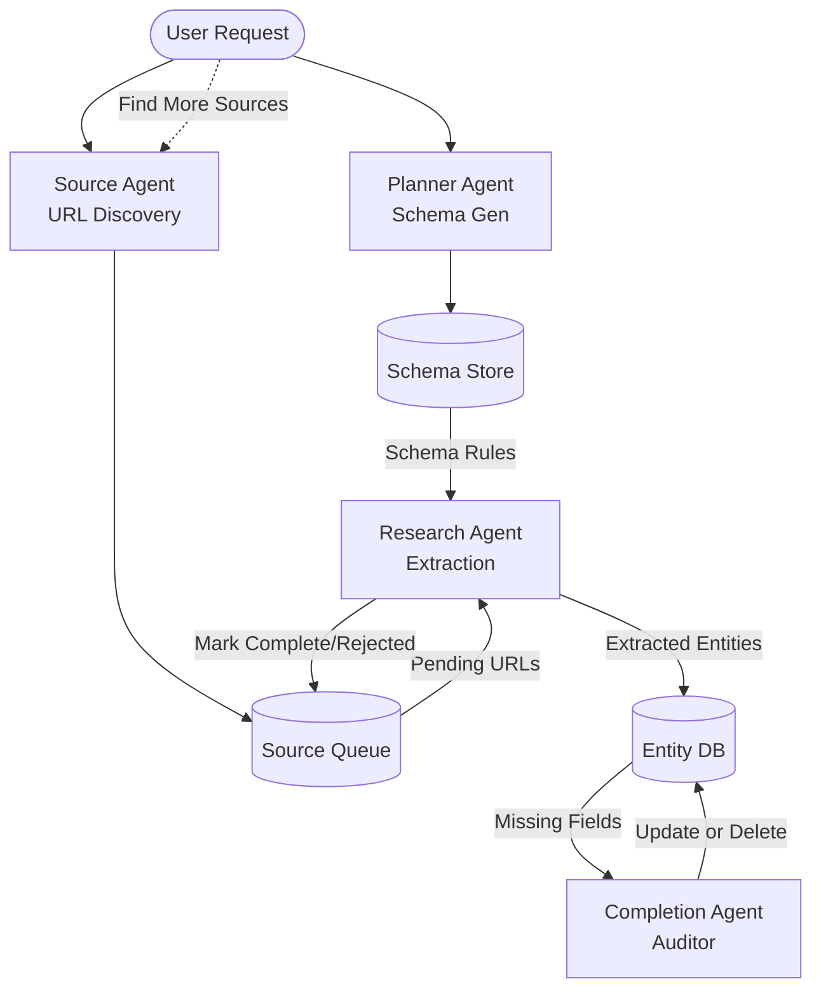

# AutoData Labs Architecture

AutoData Labs is a full-stack, autonomous research pipeline designed to extract structured datasets from the web using a network of LLM agents.

## System Overview

The system is broken down into three distinct phases:

1. **Planning Phase (Schema Generation)**
2. **Discovery Phase (Entity Identification)**
3. **Execution Phase (Data Extraction & Verification)**

### 1. Planning Phase (`POST /api/schema`)
When a user inputs a research topic in the frontend, a request is sent to the backend. This triggers the **Planner Agent** (implemented in `PlannerService`). 

#### Role of the Planner Agent
The Planner Agent acts as an intelligent "Data Architect." It is responsible for bridging the gap between a vague human query (e.g., "AI Startups") and a highly structured, strict data extraction schema. Instead of guessing, it is grounded in reality through autonomous web research.

#### Tools and Technologies Used by the Planner Agent
- **ISearchProvider (DuckDuckGo / `ddgs`)**: The agent uses this tool to conduct a preliminary web search on the user's topic. It extracts a list of relevant text snippets (titles and descriptions) from the top search results to build context.
- **Local LLM (Ollama / `qwen2.5:7b-instruct`)**: The agent passes the research context to the LLM to dynamically generate a JSON schema representing the ideal tabular structure for that topic (columns, data types, and reasoning), completely grounded in real-world facts.
- **Robust JSON Extraction Layer**: Because LLMs can be unpredictable with formatting (e.g., returning markdown blocks or indexed objects instead of arrays), the Planner Agent utilizes a custom backend parsing layer to safely extract and flatten the schema data regardless of the exact JSON structure the LLM produces.

**Interactive Validation**: The Planner Agent also acts as a gatekeeper. If the user attempts to add a custom column in the frontend, the `PlannerService` evaluates the addition (`POST /api/schema/validate`). The LLM checks if the column makes logical sense for the topic based on its research, providing a clear, text-based explanation if it rejects the addition.

### 2. Source Agent (Discovery & Queue Management)
Replacing the hallucination-prone "Discovery Phase," the **Source Agent** is responsible for actively browsing the web to find real URLs (e.g., Wikipedia lists, articles) that contain the required data. It acts as the "Librarian" building a queue for the Research Agent.

#### Key Architectural Decisions
- **Unified Relational Queue (`datasets` and `sources`):** To prevent database sprawl (creating a new table per dataset), the system uses a scalable relational pattern. The `sources` table holds all discovered URLs tied to a `dataset_id`. This allows the queue to be paused, resumed, and infinitely expanded.
- **Head-Only Fetching (The "Rough Draft"):** The Source Agent must be incredibly fast. When it finds a URL, it performs a lightweight HTTP Head-Only fetch (downloading only the `<title>` and `<meta name="description">`). It saves this as a draft description to classify the URL without downloading the heavy 5MB HTML body.
- **Universal Data Ingestion (The "Data Hunter"):** The Source Agent doesn't just look for HTML pages. It utilizes "Dorking" (e.g., `filetype:csv`, `site:github.com`) and multiple provider APIs (GitHub, HuggingFace) to hunt for raw data files. During the Head-Only fetch, it inspects the `Content-Type` header (e.g., `application/json`) and tags the source in the database so the Research Agent knows exactly which extraction strategy to use (API parser vs. HTML scraper).
- **The Research Feedback Loop:** Since Head-Only fetching can sometimes be inaccurate, the architecture relies on a self-correcting feedback loop. When the Research Agent downloads the full page to extract data, it simultaneously generates a highly accurate AI summary of the page and updates the `sources` database, overwriting the rough draft. If the page contained no useful data, the Research Agent marks it as `REJECTED`, prompting the Source Agent to fetch replacements.
- **Iterative Discovery ("Find More Sources"):** If the initial batch of sources yields insufficient data, the system can trigger the Source Agent to hunt for a fresh batch. It passes a list of all previously processed URLs (the `exclude_urls` list) to ensure the Source Agent only discovers entirely new sources, preventing infinite loops on the same websites.

### 3. Execution Phase (`POST /api/run` and `POST /api/start_extraction`)
The finalized list of entities and the schema are sent to the execution engine.
The engine uses **LangGraph** to model the execution as a state machine (`StateGraph`). 

A unique `run_id` is generated for the session. For each entity, a background task spins up the LangGraph pipeline. 

#### LangGraph Orchestrator (`services/orchestrator.py`)
Each entity passes through a sequence of nodes:
- `search_node`: Uses DuckDuckGo to find the canonical URL for the entity.
- `crawl_node`: Uses BeautifulSoup to fetch and strip the webpage HTML.
- `extract_node`: Passes the raw text and the dynamic schema to Ollama to extract structured JSON data.
- `verify_node`: (Placeholder) Verifies that the extracted data matches the schema and checks for conflicts.

### 4. Completion Phase (Data Quality & Auto-Correction)
After the Research Agent extracts data from a source, the **Completion Agent** acts as a data quality auditor. It scans the newly extracted entities for missing values (`NULL` fields).
- **Targeted Fact-Checking:** For any missing field, the Completion Agent spins up an independent, highly targeted web search (e.g., "Company X CEO name") to fill the gaps.
- **Asynchronous Execution:** These completion tasks run concurrently in the background as the main extraction pipeline continues, ensuring high throughput. The orchestrator awaits all concurrent tasks before marking the run as completed.
- **Auto-Deletion (Hallucination Guard):** If the Completion Agent conducts its targeted searches and fails to find *any* data for the missing fields, it assumes the original extraction might have been a hallucination or an invalid entity. It will autonomously delete the row from the database to maintain high dataset quality.
- **Global Deduplication:** The execution pipeline maintains a global `seen_keys` registry pulled from the database at the start of any run. This guarantees that duplicate entities are never extracted, even across multiple iterative "Find More Sources" batches.

---

## Backend Code Structure (Separation of Concerns)

The backend is built using FastAPI and strictly adheres to SOLID principles and Separation of Concerns (SoC).

- **`core/schemas.py`**: Contains all **Pydantic** models (e.g., `TopicRequest`, `RunRequest`). These define the strict contracts for API requests and responses.
- **`core/models.py`**: Contains standard **Python Dataclasses** (`Entity`, `RunLog`). These are the internal business objects stored in the database.
- **`core/interfaces.py`**: Defines abstract base classes (`ISearchProvider`, `IExtractor`) for dependency injection. Note that `ISearchProvider` returns rich objects (URL, title, snippet) so a single search provider can serve both the Planner (which needs snippets) and the Executor (which needs URLs).
- **`services/planner_service.py`**: Encapsulates all LLM interaction logic for generating schemas and discovering entities, utilizing the search provider for context.
- **`api/dependencies.py`**: A Dependency Injection container that holds singletons for the database store, the planner service, and the orchestrator.
- **`api/routes.py`**: A lightweight routing file that handles HTTP requests and utilizes injected dependencies (`Depends()`).
- **`main.py`**: The main entry point that boots up the FastAPI application.

---

## Observability & Real-Time Sync

A core philosophy of AutoData Labs is transparency. We implement a **Hybrid Observability** pattern:
1. Every time a LangGraph node executes, it emits a `RunLog` tagged with the current `run_id` to a local `SQLiteStore`.
2. A FastAPI streaming endpoint (`GET /api/stream?run_id=...`) polls the SQLite database for new logs.
3. The logs are streamed to the React frontend via **Server-Sent Events (SSE)**.
4. The React frontend uses these live events to power a Trace Chart and update KPIs dynamically in real-time, isolated strictly to the user's current session.
