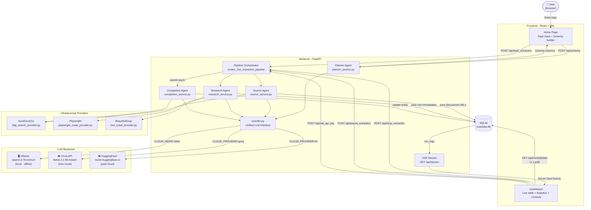

# AutoData Labs — Architecture

AutoData Labs is a full-stack autonomous research pipeline that extracts structured datasets from the web using a network of LLM agents. It is designed to run **fully offline** using a local Ollama model, with optional cloud LLM providers (Groq, Hugging Face) configurable via environment variables.

---

## System Overview



---

## Agent Pipeline

The system is broken into four sequential/concurrent phases triggered by a single `POST /api/start_extraction`:

```
[Planner Agent] ──schema──▶ [Source Agent] ──URLs──▶ [Research Agent] ──rows──▶ SQLite
                                                                                     │
                                                              [Completion Agent] ◀───┘
                                                              (concurrent, per entity)
```

### Phase 1 — Planner Agent (`POST /api/schema`)

**File:** `services/planner_service.py`

When the user enters a topic, the Planner Agent:
1. Runs a DuckDuckGo search to gather real-world context snippets
2. Passes topic + snippets to the LLM with a structured prompt
3. Returns a list of schema columns (name, type, description, is_required)

**Interactive validation:** When users add custom columns, `POST /api/schema/validate` asks the LLM if the column makes sense for the topic. The LLM returns `{ valid, reason }`.

---

### Phase 2 — Source Agent (`services/source_service.py`)

The Source Agent acts as the "Librarian" — finding real URLs that contain the required data before any heavy crawling begins.

**Key behaviours:**
- Generates targeted search queries via LLM (e.g. `"AI startups India list site:crunchbase.com"`)
- Runs multiple DuckDuckGo searches and deduplicates results
- Performs lightweight HEAD-only fetches to extract `<title>` + `<meta description>` without downloading the full page
- Classifies each URL (HTML page, CSV file, JSON API) from the `Content-Type` header
- Saves classified `Source` objects to SQLite with status `PENDING`
- **Iterative discovery:** Accepts an `exclude_urls` set so "Find More Sources" never re-discovers the same URLs

---

### Phase 3 — Research Agent (`services/research_service.py`)

For each `PENDING` source, the Research Agent:

1. **Crawl** — Uses Playwright (for JavaScript-rendered sites) or BeautifulSoup (fallback) to fetch full page HTML
2. **Cancellation check** — Immediately checks run state after the slow crawl so Stop propagates within ~1 s
3. **Chunk** — Splits the HTML content into overlapping text chunks
4. **Extract** (per chunk) — Sends each chunk + schema to the LLM and gets back a list of JSON rows
5. **Deduplicate** — Filters rows missing the primary key or already seen in `seen_keys`
6. **Stream** — Saves each valid entity to SQLite **immediately** — the frontend sees it on the next 1 s poll

This row-by-row streaming means users see data appearing live as it is extracted, not only after a source is fully processed.

---

### Phase 4 — Completion Agent (`services/completion_service.py`)

After the Research Agent processes each source, the Completion Agent audits extracted entities in parallel:

- Scans each new entity for `NULL` / empty fields
- For each missing field, runs a targeted DuckDuckGo search (e.g. `"OpenAI CEO name"`)
- Feeds the search snippet to the LLM to extract the specific field value
- Updates the entity in SQLite if a value is found

**Concurrency:** Completion tasks are submitted to a shared `ThreadPoolExecutor`. The pipeline waits for all completion futures with a 1 s polling loop that honours cancellation (rather than blocking forever with `wait()`).

---

## Pipeline Orchestration (`api/routes.py`)

The `_live_extraction_pipeline` function runs as a background thread (submitted to `ThreadPoolExecutor`). It:

- Binds the `run_id` to the worker thread via `threading.local()` so `core/llm.py` can pick up per-run API keys
- Maintains a `run_states` dictionary: `"running"` | `"paused"` | `"waiting_for_key"` | `"cancelled"`
- Exposes REST controls: `stop`, `pause`, `resume`, `set_api_key`

### Cancellation propagation

| Where | How |
|-------|-----|
| Between sources | `check_state_fn()` at top of for-loop |
| After crawl returns | Immediate state check before chunking |
| Between chunks | `check_state_fn()` inside chunk loop |
| Completion wait | 1 s polling loop with `f.cancel()` on remaining |
| API-key retry loop | `check_state_fn()` at top of while loop |

---

## LLM Abstraction Layer (`core/llm.py`)

All four agents call `core.llm.chat()` — a drop-in replacement for `ollama.chat()` that routes to the correct backend:

```
CLOUD_MODE=false  →  Ollama (local, offline)
CLOUD_MODE=true, CLOUD_PROVIDER=groq  →  Groq API (free, llama-3.1-8b-instant)
CLOUD_MODE=true, CLOUD_PROVIDER=hf   →  HuggingFace router.huggingface.co/{provider}
```

### API Key Exhaustion Flow

When the cloud API returns HTTP 429:
1. `HFKeyExhaustedException` is raised in the service
2. The pipeline catches it, sets `run_states[run_id] = "waiting_for_key"`, and logs a `api_key_exhausted` event to SQLite
3. The SSE stream delivers the event to the frontend → `ApiKeyModal` popup appears
4. User submits their own key → `POST /api/set_api_key` stores it in `_run_keys` (in-memory, never persisted)
5. `_wait_for_key()` returns the key → pipeline resumes and retries the source
6. If the user dismisses the popup → `completed_partial` outcome → "Export Partial Dataset" button appears

Per-run keys are stored in a thread-safe dictionary and cleared when the run ends.

---

## Real-Time Observability

Every state change is logged to the `run_logs` SQLite table as a `RunLog`:

```
{ log_id, run_id, entity_id, stage, outcome, error_message, timestamp }
```

The frontend consumes these via two mechanisms:

| Mechanism | Endpoint | Purpose |
|-----------|----------|---------|
| SSE stream | `GET /api/stream?run_id=` | Pipeline events, agent status, errors, API exhaustion |
| 1 s data poll | `GET /api/run/{id}/data` | Newly extracted entity rows (the live table) |

This hybrid approach means the table updates within 1 second of each row being saved, while the agent log trace is pushed instantly via SSE.

---

## Backend Code Structure

```
core/
  llm.py            Unified chat() — Ollama / Groq / HuggingFace
  models.py         Dataclasses: Entity, RunLog, Source, FieldValue
  schemas.py        Pydantic models for API requests/responses
  interfaces.py     ABCs: ISearchProvider, ICrawlProvider
  prompts.py        All LLM prompt templates

services/
  planner_service.py    Schema generation, column validation
  source_service.py     URL discovery, metadata fetch, LLM classification
  research_service.py   Crawl → chunk → extract → save (streaming)
  completion_service.py Missing-field gap-filling with targeted search

providers/
  ddg_search_provider.py       DuckDuckGo via ddgs
  playwright_crawl_provider.py JS-rendered page crawling
  bs4_crawl_provider.py        Static HTML fallback
  ollama_extractor.py          Legacy direct-Ollama extractor

api/
  routes.py         All HTTP endpoints + _live_extraction_pipeline
  dependencies.py   FastAPI DI container (singletons)

persistence/
  sqlite_store.py   CRUD for entities, sources, run_logs

tests/
  test_llm.py       Unit tests: Ollama path, HF 200/429/503, per-run keys, thread isolation
```

---

## Key Design Principles

| Principle | Implementation |
|-----------|---------------|
| **Offline-first** | Ollama is default; cloud is opt-in via `.env` |
| **Streaming results** | Rows saved + visible immediately, not batch-at-end |
| **Cooperative cancellation** | `check_state_fn()` at every IO boundary |
| **No vendor lock-in** | `ISearchProvider` / `ICrawlProvider` are swappable |
| **Session-scoped secrets** | Per-run API keys live in memory only, never touch disk |
| **Separation of concerns** | Each agent is a pure service with injected providers |
